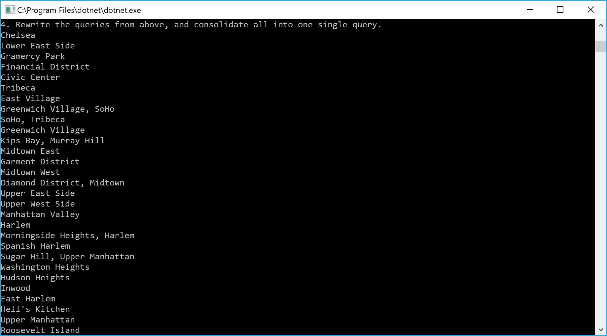

# Lab-08-LINQ
CODE: LINQ for Code Fellows 401 C#/ASP.NET assignment

**Author**: Earl Jay Caoile  
**Version**: 1.0.0

## Overview
This console app shows manipulation of a JSON file using LINQ. It takes listings of
properties and breaks them down into neighborhoods.

## Getting Started
The following is required to run the program.
1. Visual Studio 2017 
2. The .NET desktop development workload enabled
3. No External NuGet packages are required for this application. 

## Example

## Architecture
This application is created using ASP.NET Core 2.0 Console applicaitons.  
*Language*: C#  
*Type of Applicaiton*: Console Application  

## Change Log
06-15-2018 9:00 AM - initial scaffolding
06-15-2018 10:00 AM - converted JSON file into a string
06-15-2018 1:00 PM - managed to turn string into an object
06-15-2018 1:30 PM - managed to turn string into an object
06-15-2018 2:00 PM - finished first 3 queries
06-15-2018 4:00 PM - finished last two combo queries
06-15-2018 5:20 PM - readme complete

